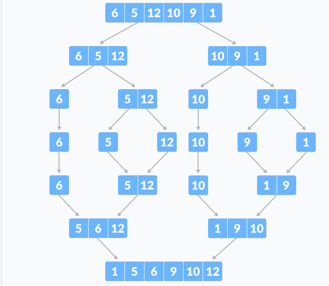

# Computer Systems

### 重点


* [ ] 能够看懂常用汇编代码
* [ ] 理解过程(函数调用)
* [ ] 深入理解指针

### 涉及的Linux指令

```
gcc -Og -S mstore.c  //生成mstore.s汇编文件
gcc -Og -c mstore.c  //生成mstore.o二进制文件 00 01 89人看不懂
objdump -d mstore.o  //将机器文件转换成人能看得懂的汇编代码
```


### 常用的汇编指令以及寄存器

X86寄存器

.png>)

mstore.s




### 过程

设计良好的软件用过程作为抽象机制，隐藏某个行为的具体实现，同时提供清晰简明的接口定义。eg:函数、方法、处理函数等等；

程序计数器记录一个过程的起始地址(函数)，单一个函数P中调用函数Q时，对应的汇编call Q,对应的动作是先将函数P的当前运行的位置(程序计数寄存器)进行入栈保存，然后加载P函数的函数起始地址。在Q返回时通过寄存器rax返回一个值然后出栈，程序计数器读取入栈保存的地址，函数P继续运行。

.png>)

函数参数就是用rdi、rsi、rdx等5个寄存器进行保存，参数超过5个就将栈指针往下进行偏移扩大栈空间保存超过5个以上的参数并且要进行字节对齐。字节对齐就是参数的大小没超过16字节也要占着这么大的空间，在stm32A单片机ARM架构中是8字节对齐；
