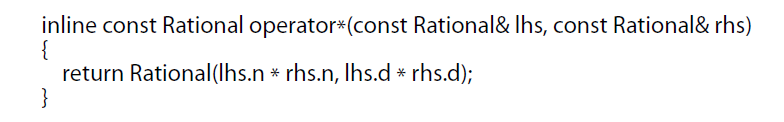

# effective c++

之前以为stl源码剖析会比这本书更难看懂，没想到这本书还是有点难啃的。再加上有的翻译一开始还不太习惯，因为中国台湾跟我们有的名词有点不一样，像给我们上课的台湾老师一般都是说程式，我们这边说代码。所以说如果想搜索一些台湾的资料的话可以按照台湾那边的翻译进行搜索。这本书我阅读出现让我不太习惯的就是default在台湾那边是缺省，我们这边一般是默认，还有就是“型别”，我们一般都是讲类型。当然这些在译序上有说明，但是阅读上还是要去习惯中国台湾那边的说法。

## 1.让自己习惯c++

### 条款1：将c++看成一个语言联邦

federation（联邦）：a country consisting of a group of individual states that have control over their own affairs but are controlled by a central government for national decisions

主要分成四个次语言：C ,面向对象 ，模板，STL；

#### C

主要就是面向过程。c语言的局限：没有模板，没有重载，没有异常..前面两个比较好理解，没有异常我感觉是不是因为没有多线程所以没有异常。

#### 面向对象

面向对象就是那些特征：继承、封装、多态、重载、virtual函数（动态绑定）...关于动态绑定后面经常都会提到，还有静态绑定。静态绑定就是在编译器编译的时候就绑定好了，比如说函数重载的时候编译器根据类型选择相互匹配的来绑定。动态绑定就是virtual关键字，会生成一个虚函数表，在程序运行的时候进行绑定“函数”。关于virtual在第六大章继承与面向对象设计 这部分会有更详细的讲解。

#### 泛型编程

记得有谁说过现在程序员对于面向对象都会有更熟悉的使用，对于泛型编程还不是那么的主流。

实际上templates威力强大，它带来崭新的编程范型，就是所谓的模板**元编程。**&#x20;

元编程在QT中应该是用到的，但是之前看的c++qt设计模式这本书元编程是放在最后几章了还没看到，所以还不懂它的威力。

stl中的萃取应该就是用到了模板的功能，萃取了解的没有那么深入。感兴趣的可以看stl迭代器的部分。

#### stl

stl是个template程序库。

### 条款2：尽量以const，enmu，inline替换#define

这边记录自己书上画的重点句子。

\#define的名称可能从没有被编译器看见。

\#define并不重视作用域，这意味着不能提供任何封装性。而const成员变量是可以被封装的。其实在嵌入式当中的c语言会看到还是经常用define的

### 条款03：尽可能的使用const

### 条款04：确定对象被使用前已先被初始化

## 4.设计与声明

### 条款18：让接口容易被正确使用，不易被误用

比如接口是要输入年月日，那么要考虑参数的顺序，也要考虑参数的限制。比如说一年只有12个月，可是如果客户不小心输入14月的话，这种接口的设计就是不合理的。其中可以利用enum来表示月份，但是enums不具备类型安全性。

限制类型内什么事情可做，什么事情不能做，常见的就是加上const限定。

避免与内置类型不兼容，为了提供行为一致的接口。eg每个stl容器都有一个名为size的成员函数。

设计出的接口不能让客户额外的去做某些事情，eg：工厂函数返回一个类指针，其中这个资源是new出来的，所以客户用了这个函数还需要delete这部分资源。这样的设计是非常糟糕的。

工厂模式：所谓的工厂就是生产东西的地方，对应到代码中就是class类的实例化的地方。工厂函数就是返回工厂中类实例出来的指针。

用智能智能的话可以避免资源的泄露（忘记delete），工厂函数如果返回智能指针的话就能阻止很多人犯下资源泄露的错误。

### 条款19：设计class犹如设计type

设计每一个class的时候记得想到这些提问

**新type的对象应该如何被创建和销毁？**

**对象的初始化和对象的赋值应该有什么样的区别?**

**新type的对象如果以值传递，意味着什么？**

**什么是新type的“合法值”？**

**新的type需要配合某个继承图系吗？**

**新的type需要什么样的转换？**

**什么样的操作符和函数对此新type而言是合理的？**

**什么样的标准函数应该驳回？**

。。

### 条款20：用引用替换值传递

用值传递的话就要创建一个副本，这样子的话如果值传递一个类的话，那么它的消耗会非常大。因为这个副本创建的时候需要一次构造函数，如果这个类还有复合的类的话就不止一次构造函数了。副本离开作用域的时候需要析构。这种成本可能导致程序的性能受到影响。

用引用的话就没有这些开销，因为引用是右值，所以说这个类肯定在先前就已经创建好了。当然引用的的话成员函数可以利用这个指针更改类中的内容，这样的话就会破坏封装性，可以用const进行修饰来避免。

如果说对象是内置类型（int，short等等），这种可能比引用效率还高，如果就传递一个字节的参数的话，值传递的效率应该比引用的高。指针都占用4个字节了。

### 条款21：必须返回对象时，别妄想返回其reference

条款20说了引用的好处可能会导致我们会犯下一些致命的错误：传递一些references指向其实并不存在的对象。

其实引用只是一个名称，代表某个已经实例化的对象。任何时候看到reference声明式，都应该立刻问自己，它的另一个名称是什么？因为它一定是某物的另一个名称。

在函数中创建对象并且返回其指针：不管是在栈区还是堆区都是非常糟糕的代码。如果是栈区声明那么离开函数作用域的时候这个对象就不存在了。如果在堆区new一个，返回的话那么客户还要delete这个资源。如果在堆区创建然后返回智能指针呢？应该会好一点点把哈哈哈哈。

一个“必须返回新对象”的函数正确写法是：让那个函数返回一个新对象。

当然你需要承受operator\*返回值的构造成本和析构成本

### 条款22：将成员变量声明为private

如果成员变量不是public，客户**唯一**能够访问对象的办法就是通过成员函数

明白这个事实：使用函数可以让你对成员变量的处理有更精准的控制。

当你需要得到成员变量的时候，就定义一个“get该变量”的成员函数。要更改时就定义“set“成员函数。

还要明白一个事实说服你将成员变量声明为private：封装性，如果你通过函数访问成员变量，日后需要更改某个成员变量的时候，在class客户的视角中不会知道class内部实现已经发生了变化。

封装的重要性比你最初见到它的时候还重要。

protected并不比public更具封装性。

一旦将一个成员函数声明为public后者protected而客户开始使用它，就很难改变该成员变量所涉及的一切。因为太多代码需要重写、重新测试、重新编写文档、重新编译。

### 条款23：用non-number、non-friend、替换成员函数

面向对象守（用首替换守会不会更好理解？）则要求：数据以及操作数据的那些函数应该被绑定在一块、这意味着成员函数是个较好的选择。但是这个建议时❌的。

提供非成员函数可以对类的相关机能有较大的包裹性，而那导致较低的编译相依度，增加类的课延伸性。

越多的东西被封装，就越少人可以看到它。而越少的人能看到他，我们就有越大的弹性去变化它。

我们推崇封装的原因：它使我们能够改变事物而只影响小部分的客户。

能够访问private的变量的函数只有该类的成员函数和friend函数而已。

**请记住：用非成员和非友员函数替换成员函数，可以增加封装性、包裹性和机能扩展性。**

****

### **条款24：若所有参数都需要类型转换，请为此采用non-member函数**

### **条款25：考虑写出一个不throwing异常的swap函数**

## 6.继承与面向对象设计

### 条款32：确定你的public继承塑造出is-a关系

必须必须必须要明白以c++进行面向对象编程，最重要的规则是：<mark style="color:red;">**public继承以为”is'-a“的关系**</mark><mark style="color:red;">。</mark>

每个学生都是人，但并非每个人都是学生，这便是继承体系的主张。

is-a的关系听起来很简单，但有的时候你的直觉可能会误导你。

eg：企鹅是一种鸟这是一个事实。鸟可以飞，也是事实。如果企鹅继承了鸟，按照is-a，那么企鹅也能飞了！！所以我们应该承认：有少数的鸟不会飞。

那么应该怎么解决？在定义flybird的类来继承原本的bird。原来bird类的fly（）成员函数放在flybird类中并且声明为虚函数。

另一种思想派别：让企鹅重新定义fly函数，让fly函数产生一个运行期错误。

但是运行期间产生错误会让你脑子想到这个肯定就不是好的设计！！所以要让他在编译期间就产生错误！

运行期间产生错误：即企鹅不会飞，但是它尝试飞之后才知道，如果企鹅在高楼尝试的话它可能GG了哈哈哈哈哈。

编译期间产生错误：即让编译器让企鹅不要尝试飞，避免了危险。

书上还有个矩形和正方形的例子！P154

编译器会让不是is-a的继承关系通过，但这并不保证程序的行为正确。

**请记住：**public继承意味着is-a。适用于基类身上的每一件事情一定也适用于derived class身上，因为每一个derived class对象也都是一个base class对象。

### 条款33：避免遮掩继承而来的名称

主要就是作用域的问题。

如果派生类定义一个基类已经有的变量的话，那么这个派生类的变量会覆盖掉基础类的变量。除非你用作用域(::)。

书上有个例子：基类带有函数fun1及重载该函数。如果派生类继承了该基类并且重新定义了fun1函数，但是派生类并没有重载fun1。在main中声明派生类a，并且调用a.fun1()是可以调用派生类所声明的函数，但是如果调用fun1的重载的话就不能调用基类的重载！！因为基类fun1的被派生类覆盖了！！

如果你一定要覆盖基类的变量，那么你必须为那些原本被遮掩的每个名称引入一个**using**声明，否则某些你希望继承的名称会被遮掩。

其实你用using解决了这个遮掩的问题，但是它其实还是违反了is-a的关系。

### 条款34：区分接口继承和实现继承

public继承之后其实由两个部分组成：函数接口继承和函数实现继承。

这两个差异就像函数声明与函数定义之间的差异。

这个条款感觉讲的就是虚函数和纯虚函数及成员函数对应继承的接口关系。

#### 纯虚函数

类中声明纯虚函数会让这个类成为一个抽象类，抽象类是不能够实例化的！

纯虚函数最突出的特征：他们必须被任何继承该类的派生类重新声明，而且纯虚函数在抽象类中通常没有定义。

声明纯虚函数的目的就是为了让派生类只继承函数的接口，相当于对派生类的设计者说“你必须实现纯虚函数，但我不干涉你怎么实现”

#### 虚函数

虚函数会提供一份代码，派生类可能覆盖它。

声明虚函数的目的：让派生类继承该函数的接口和默认实现。

但是虚函数同时指定函数声明和函数的默认行为却有可能造成危险。eg：飞机A和飞机B都是飞向北京的，所以为了遵守OO原则，在基类ariplane中定义了虚函数并且默认飞往北京。过段时间买了新的飞机C，程序员让其上线的时候太急了继承了airplane忘记重新定义fly函数，导致它飞错了地方。

#### 避免虚函数的危害

为了避免情况在发生，将fly声明为纯虚函数。让飞机A和B（想使用虚函数中的默认行为）在其fly函数中对defaultfly做一个inline调用（条款30：inline函数和virtual函数之间的交互）。而对于C型飞机来说因为虚函数的原因迫使它必需提供自己的fly版本。

但是在飞机A和B中在fly中调用defaultfly虚函数不是一个好的设计。p166讲关于defaultfly不好有点晦涩难懂。是因为它变成了protected吗？还是p167说的如果合并fly和defaultfly就丧失了“让两个函数享有不同保护级别”的机会。

所以说好的设计是：我们利用“纯虚函数必须在派生类中重新定义，但它们**可以拥有自己的实现**”。利用纯虚函数可以拥有自己的实现这一点让我们在这个实现部分来定义默认飞机飞往北京，来替代前面的defaultfly虚函数。

.png>)

.png>)

#### 非虚成员函数

在public继承体系当中，如果成员函数是飞成员函数，意味着它并不打算在派生类中有不同的行为。非虚成员函数所表现的不变形凌驾其特异性。

声明非虚成员函数的目的是：让派生类继承函数的接口及一份强制性实现。

这三种函数的差异使得我们能够非常精准的指定你想要的派生类继承的东西，是只继承接口，还是继承接口和一份默认行为，或是继承接口和一份强制实现。

#### 经验不足的class最常犯的两个错误

1.将所有的函数声明为非虚函数，这使派生类没有额外的空间进行特化工作。并且基类的析构没有声明为虚函数会有资源泄露的后果（条款7）。不要过度担心虚函数的效率成本。

&#x20;2.将所有的成员函数声明为virtual。有时候这样是正确的（eg条款31）

### 条款35：考虑virtual函数以外的其他选择

### 条款36：绝不重新定义继承而来的非虚函数

如果真的懂条款33就会对public继承的接口有更深刻理解，非虚函数对应的就是一个接口加上强制的行为，如果你要重新定义，应该将它设计为虚函数

### 等待更新

后面的就暂时先不更新了，明天要开始新一周的计划了。

