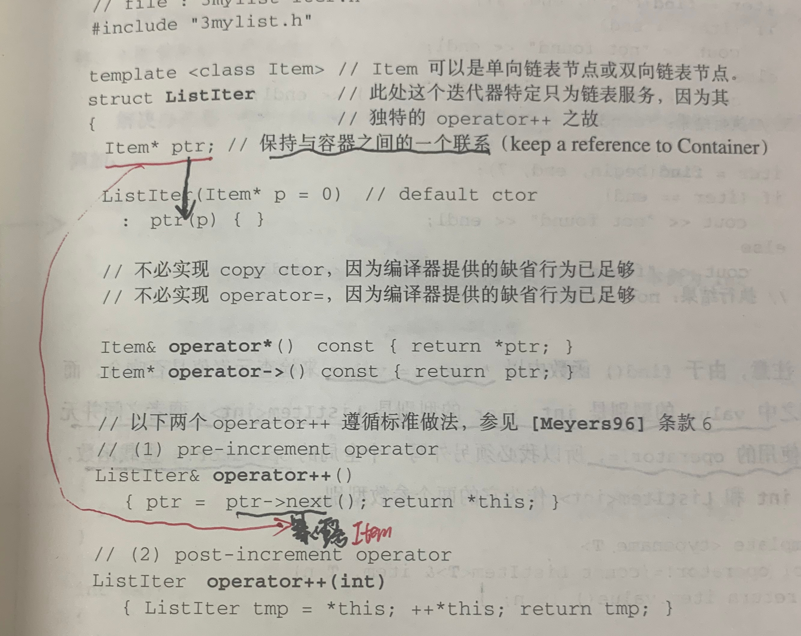

# STL源码剖析

## 空间配置器allocator

这本书一上来就是给个标准接口非常的蒙，如果你提前知道这个空间配置器就是给容器分配内存空间，并且能够管理这个内存空间。然后带着一个管理容器内存的**类**需要什么类型变量和成员函数等等去看这章节内容会有更好的效果。《effective c++》的条款13 ：以对象管理资源 ，尽量用对象来管理资源其中autoptr能够确保析构函数释放这些资源，这个条款还有其他细节了auto\_ptr复制构造会导致之前的失效等等具体看书。

#### 简介

allocator是负责封装内存管理的**对象**。

空间不一定是内存，空间也可以是磁盘或其他辅助存储介质。你可以写一个allocator直接向硬盘取空间。

new不允许控制调用哪些构造函数，而只能同时构造所有对象（它迫使您同时构建所有对象）。这是 std:: allocator优于 new。

 (1).png>)

[What's the advantage of using std::allocator instead of new in C++?](https://stackoverflow.com/questions/31358804/whats-the-advantage-of-using-stdallocator-instead-of-new-in-c)

#### allocator类的组成

这部分代码来自[https://en.cppreference.com/w/cpp/memory/allocator](https://en.cppreference.com/w/cpp/memory/allocator)

```
    {
        // default allocator for ints
        std::allocator<int> alloc; //int就是 value_type
        
        // demonstrating the few directly usable members
        static_assert(std::is_same_v<int, decltype(alloc)::value_type>);
        int* p = alloc.allocate(1);  // space for one int
        alloc.deallocate(p, 1);      // and it is gone
 
        // Even those can be used through traits though, so no need
        using traits_t = std::allocator_traits<decltype(alloc)>; // The matching trait
        p = traits_t::allocate(alloc, 1);
        traits_t::construct(alloc, p, 7);       // construct the int
        std::cout << *p << '\n';
        traits_t::deallocate(alloc, p, 1);      // deallocate space for one int
    }
    {
        // default allocator for strings
        std::allocator<std::string> alloc;
        // matching traits
        using traits_t = std::allocator_traits<decltype(alloc)>;
 
        // Rebinding the allocator using the trait for strings gets the same type
        traits_t::rebind_alloc<std::string> alloc_ = alloc;
 
        std::string* p = traits_t::allocate(alloc, 2); // space for 2 strings
 
        traits_t::construct(alloc, p, "foo");
        traits_t::construct(alloc, p + 1, "bar");
 
        std::cout << p[0] << ' ' << p[1] << '\n';
 
        traits_t::destroy(alloc, p + 1);
        traits_t::destroy(alloc, p);
        traits_t::deallocate(alloc, p, 2);
    }
```

std::allocator\_traits这个应该是用了迭代器中所说的萃取，这个实在c++11中出现的。之前应该是allocator::rebind这个函数。

内存配置allocate()负责，内存释放deallocate()负责。对象构造construct（）负责，对象析构destroy()负责。

#### 构造和析构

construct()的用途就是将初值设定到指针所指的空间上。

destroy()第一种是直接调用对象的析构函数，第二种就是删除规定范围内的所有对象析构掉。

#### 空间的配置与释放

内存配置基本就是调用::operator new，内存释放::operator delete()。

但是为了减少内存碎片提高内存使用效率，分成双层配置器。

第一级很简单当内存大于128 bytes时就是直接调用malloc()。

第二级配置就是当小于128 bytes时使用，第二级的设计就是按一个字节（8bytes）为最小单位，然后将128分成（128/8）16份。利用union可以避免维护链表的开销。看书上的图更好理解。


## 迭代器模式

**《大话设计模式》第20章**

对于售票员来说，最重要的事情就是把车厢内所有的人都遍历一遍，不放过任何一个买票的乘客，不管他是外国人还是领导还是流氓售票员都要对他们每一个人进行收票。这也是一种设计模式的体现。

**iterator模式**：提供一种方法，使之能够依序寻访某个容器所含的**各个**元素，而又无需暴露该容器的内部表述方式。

当你需要访问一个聚集对象（车厢内的人），而且不管这些人是中国人还是外国人都需要遍历的时候，就应该考虑迭代器模式。而对于STL的容器来说，不管是什么类型都需要遍历。&#x20;

**foreach in**：在jave中和c#中已经内置在语言当中。

### **迭代器实现**

**** (1).png>)****

迭代器就是分离集合对象的遍历行为，抽象出一个迭代器类来负责，这样既可以做到不暴露集合的内部结构，又可以让外部代码透明的访问集合内部的数据。

迭代器模式尤其是在数据库数据操作时，是非常普遍的应用。

## 迭代器概念与traits编程技法

### 迭代器设计思维

迭代器允许您将算法与容器分开。只要您有一个开始和结束迭代器，并且知道迭代器的功能（随机访问等），您就可以对迭代器指定的范围进行操作。这样，您可以只实现一个算法版本，而不需要为您希望它运行的每个容器编写一个新版本。

迭代器充当将算法连接到 STL 容器的桥梁，并允许修改容器内的数据。它们允许您遍历容器、访问和分配值，并对它们运行不同的运算符，以获得所需的结果。

迭代器将算法**粘合**到容器上，而不是耦合两者。迭代器与容器耦合，算法与迭代器的接口耦合。这里的神奇之处在于模板编程。

### 迭代器是一种smart pointer

迭代器是一种行为类试指针的对象，要有指针的行为，就要对\*和->进行重载工作。



为了达成operator++的目的，我们**暴露**了listtem操作函数next（）。如果不是为了迭代器listitem原本应该完全隐藏起来不曝光的。

将迭代器的开发工作交给list的设计者，这样所有实现细节反而能够封装起来不被使用者看到。这就是为什么每一种stl容器都提供专属迭代器的缘故。

### 迭代器相应类型

什么是相应类型?迭代器所指之物的类型就是其一。

利用函数模板的参数推导可以拿来做变量声明用途。

我们以func()做为对外接口，却把实际操作全部置于func\_impl()之中。由于func\_impl是一个函数模板，一旦被调用，编译器会自动进行模板参数推导，就可以导出类型T，顺利解决问题。

最常用的类型有五种：iterator_category、value\_type、difference_\_type、pointer、reference；

### Traits编程技法

上述的模板参数推导机制智能推导参数，确不可以推导函数返回值类型。

可以在func（）的返回类型加上typename关键字，但是有隐藏的陷阱：并不是所有的迭代器都是class类型，普通指针就不是class类型。

我们可以针对“迭代器之template参数为指针”者，设计特化版的迭代器。

用class template专门“萃取”迭代器的特性，而value type正是迭代器的特性之一。

多一层间接性带来的**好处是traits可以拥有特化版本**，这样原生指针int\*虽然不是一种class type，确可以通过traits取其value type。

#### 模板偏特化（Template Partitial Specialization）[https://en.cppreference.com/w/cpp/language/template\_specialization](https://en.cppreference.com/w/cpp/language/template\_specialization)

```
#include <iostream>
 
template<typename T> // primary template
struct is_void : std::false_type {};
template<>           // explicit specialization for T = void
struct is_void<void> : std::true_type {};
 
int main()
{
    // for any type T other than void, the class is derived from false_type
    std::cout << is_void<char>::value << '\n'; 
    // but when T is void, the class is derived from true_type
    std::cout << is_void<void>::value << '\n';
}
```

一定要为你的容器的迭代器定义五种相应类型，traits会原滋原味榨取出来。同时iterator\_traits**必须**对传入的类型为指针和const指针等设计**特化**版本。

## adapter配置器

adapters在stl组件中扮演者轴承、转换器的角色。adapters其实也是一种设计模式。

### adapter设计模式

\--大话设计模式第17章--

**适配器模式**：将一个类的接口转换成客户希望的另外一个接口。adapter模式使得原本由于接口不兼容而不能一起工作的那些类可以一起工作。

当系统的数据和行为都正确，**但**接口不符合时，我们应该考虑用适配器，目的是使控制范围之外的一个原有对象与某个**接口匹配**。适配器模式主要应用于复用一些现存的类，但是接口有与复用环境要求不一致的情况。

适配器模式两种类型：类适配器模式和对象适配器模式；

**类适配器**模式通过多重继承对一个接口与另一个接口进行匹配。jave、c#不支持多重继承（一个类只有一个父类）。所以后序讲的是**对象适配器**。

#### 何时使用适配器模式

两个类所做的事情相同或相似，但具有不同的接口时要使用它。

但是这样有点亡羊补牢的感觉，如果条件允许在接口不同时，首先不应该考虑适配器，而是考虑通过重构统一接口。

所以要在双方都不太容易修改的时候再使用适配器模式匹配。

#### 代码结构

 (1).png>)

#### 扁鹊的医术

如果能事先预防接口不同的问题，不匹配问题就不会发生；

在有晓得接口不统一问题发生时，及时重构，问题不至于扩大；

只有碰到无法改变原有设计和代码的情况时，才考虑适配；

适配器是好模式，但如果无视它的应用场合而盲目使用，其实是本末倒置的；

